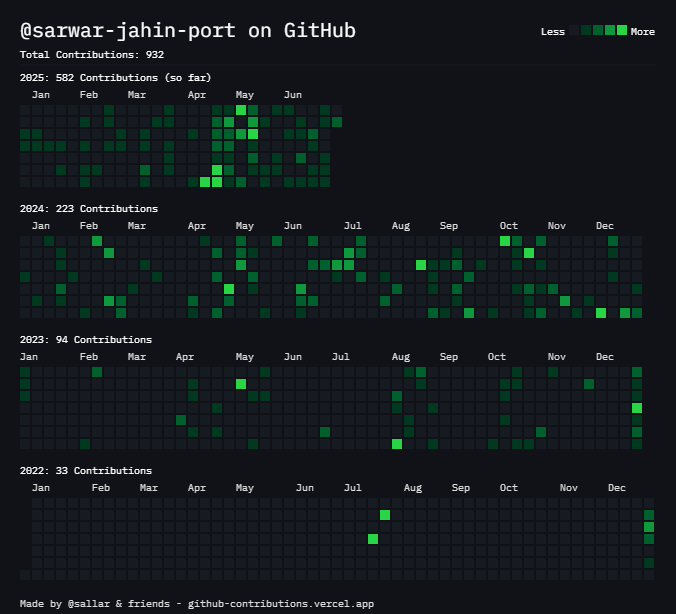

# Hi there, I'm Sarwar Jahin 👋

<div align="center">
  
</div>

<p align="center">
  <a href="https://my-portfolio-lac-eight-78.vercel.app/"></a>
  <a href="https://www.linkedin.com/in/sarwar-jahin-a25437359/"></a>
  <a href="https://x.com/sarwarrjahin"></a>
  <a href="mailto:sarwarjahin@gmail.com"></a>
</p>

---

## 🚀 About Me

I'm a passionate **Full Stack Developer** with expertise in building scalable web applications and solving complex problems through code. I love creating efficient, user-friendly solutions that make a real impact.

- 🔭 I'm currently working on **Grownext**
- 🌱 I'm currently learning **Devops**
- 👯 I'm looking to collaborate on **Open Source Projects**
- 🤔 I'm looking for help with **Aws Setup**
- 💬 Ask me about **React, Node.js, Django, Python**
- 📫 How to reach me: **sarwarjahin@gmail.com**
- ⚡ Fun fact: **I love coding**

---

## 🛠️ Tech Stack

### Frontend


### Backend


### Database


### Cloud & DevOps


### Tools & Others


---

## 🔥 Contribution Streak

<p align="center">
  
</p>

---

## 🎯 Featured Projects

<div align="center">
  
### 🧾 [Ledger Book Frontend](https://github.com/mdarifhussain9122/ledgerbook-frontend)
[](https://github.com/mdarifhussain9122/ledgerbook-frontend)

**Tech Stack:** React.js, Tailwind CSS, Axios, Chart.js  
**Features:**  
- User authentication  
- Add, edit & delete income/expense entries  
- Filter by category and date  
- Visualize expenses via bar and pie charts  
- Responsive dashboard layout

---

### 📋 [Event Management App](https://github.com/sarwar-jahin-port/event_management_django)
[](https://github.com/sarwar-jahin-port/event_management_django)

**Tech Stack:** Django, Django REST Framework, PostgreSQL, TailwindCSS  
**Features:** Event creation & registration, Role-based access, User dashboard, Email notifications

---

### 🌤️ [Weather Dashboard](https://github.com/yourusername/weather-dashboard)
[](https://github.com/yourusername/weather-dashboard)

**Tech Stack:** React, Chart.js, Weather API, CSS Modules  
**Features:** Real-time weather data, Interactive charts, Location-based forecasts

</div>

---

## 🎓 Certifications & Education

- 🎓 **Bachelor's Degree in Computer Science** - INTERNATIONAL ISLAMIC UNIVERSITY CHITTAGONG (2023)
- 🏆 **Full Stack Web Development** - [Programming Hero] (2024)
- 🏆 **CSE Fundamentals & Software Development** - [Phitron] (2025)

---

## 📝 Latest Blog Posts

<!-- BLOG-POST-LIST:START -->
- [Building Scalable React Applications with Custom Hooks](https://yourblog.com/post1)
- [Optimizing Database Queries for Better Performance](https://yourblog.com/post2)
- [Introduction to Microservices Architecture](https://yourblog.com/post3)
- [Best Practices for API Design and Development](https://yourblog.com/post4)
<!-- BLOG-POST-LIST:END -->

---

## 🎯 What I'm Working On

- 🔭 **Current Focus:** Building a full-stack social media application with real-time features
- 🌱 **Learning:** Exploring serverless architecture and advanced DevOps practices
- 👥 **Open Source:** Contributing to React ecosystem and developer tools
- 📚 **Goals 2024:** Master cloud architecture, contribute to 10+ open source projects

---

## 💼 Professional Experience

### Senior Full Stack Developer | [Company Name]
**Duration:** Jan 2023 - Present
- Led development of enterprise web applications serving 10,000+ users
- Implemented microservices architecture reducing system downtime by 40%
- Mentored junior developers and conducted code reviews

### Full Stack Developer | [Previous Company]
**Duration:** Jun 2021 - Dec 2022
- Developed and maintained multiple client projects using React and Node.js
- Optimized application performance resulting in 50% faster load times
- Collaborated with cross-functional teams in Agile environment

---

## 🏅 Achievements & Recognition

- 🥇 **First Place** - [Hackathon Name] 2023
- 🏆 **Employee of the Month** - [Company Name] (3 times)
- 🌟 **Open Source Contributor** - 500+ contributions across various projects
- 📊 **Tech Speaker** - Presented at [Conference/Meetup Name]

---

## 📊 Coding Activity

<!--START_SECTION:waka-->
```text
JavaScript   8 hrs 15 mins   ████████████░░░░░░░░░░░░░   48.32%
TypeScript   4 hrs 20 mins   ██████░░░░░░░░░░░░░░░░░░░   25.43%
Python       2 hrs 45 mins   ████░░░░░░░░░░░░░░░░░░░░░   16.12%
CSS          1 hr 30 mins    ██░░░░░░░░░░░░░░░░░░░░░░░   08.82%
HTML         15 mins         ░░░░░░░░░░░░░░░░░░░░░░░░░   01.31%
```
<!--END_SECTION:waka-->

---

## 🤝 Let's Connect!

I'm always open to discussing new opportunities, collaborating on interesting projects, or just having a chat about technology!

<div align="center">
  
### 📫 Get in Touch
[](https://your-portfolio.com)
[](https://linkedin.com/in/yourprofile)
[](https://twitter.com/yourhandle)
[](mailto:your.email@example.com)

### 💖 Support My Work
[](https://buymeacoffee.com/yourusername)
[](https://ko-fi.com/yourusername)

</div>

---

<div align="center">
  
  
  **"Code is like humor. When you have to explain it, it's bad."** - Cory House
</div>

---

<div align="center">
  <h3>⭐ Star some repositories if you find them interesting!</h3>
  <p>
     
    <em><b>I love connecting with different people</b> so if you want to say <b>hi, I'll be happy to meet you more!</b> 😊</em>
  </p>
</div>
